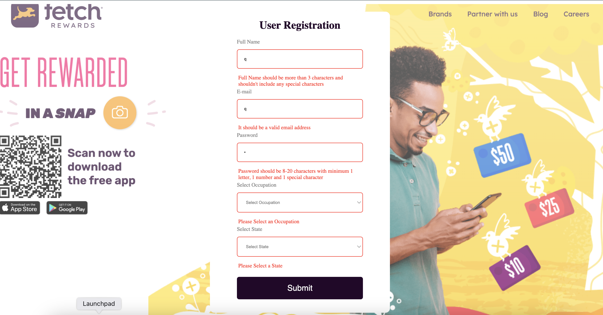
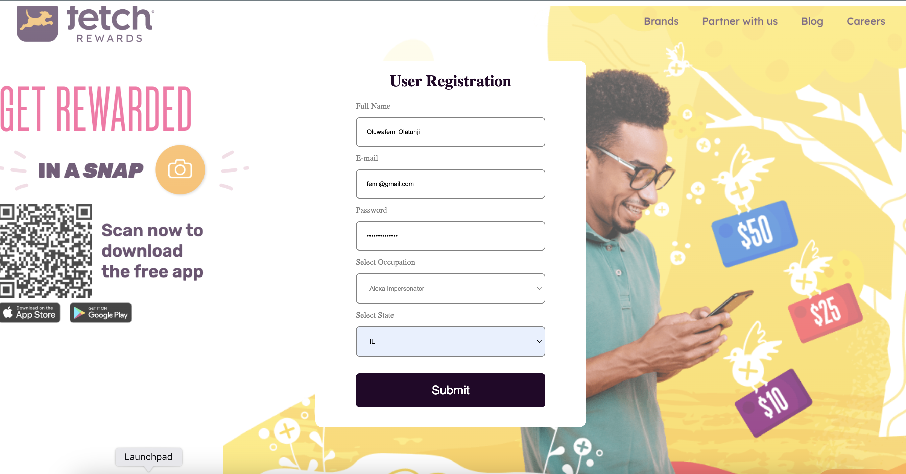
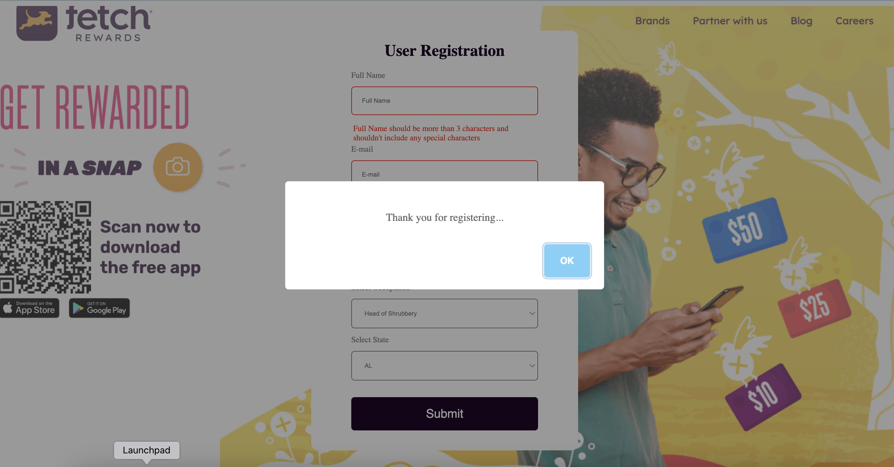

<h1 align="center">Welcome to User Registration form 👋</h1>
<p>
  
  <a href="https://aesthetic-cactus-92c34f.netlify.app/" target="_blank">
  </a>
</p>

# 🏠 Homepage:  <a href="https://aesthetic-cactus-92c34f.netlify.app/" target="_blank"> Click here to View</a>

## ✨ Task
    Your task is to build a webpage with a user creation form. The form should take the following required inputs:
    Full Name
    Email
    Password
    Occupation
    State.

    Occupation and State should allow users to select from options returned by an endpoint. Users should only be able to select one occupation and one state. A GET request to https://frontend-take-home.fetchrewards.com/form
        {
             "occupations": [
             "occupation1",
             "occupation2",
             ...
            ],
            "states": [
                {
                    "name": "Alabama",
                    "abbreviation": "AL"
                },
                ...
            ]
        }


###
    You should submit the results of the form to the same endpoint (https://frontend-take-home.fetchrewards.com/form) via a POST request with a JSON body of the following format:
    {
    "name": "???",
    "email": "???",
    "password": "???",
    "occupation": "???",
    "state": "???"
    }
    The POST endpoint will return a 201 status code if all fields are provided. The response body will be the created user object. It does not perform any validation beyond this.

##
Minimum Requirements, Your site must:

    1. Display a form with inputs for each field outlined above
    2. Allow a user to complete and submit the form
    3. Do not allow form submission without completing the entire form
    4. Provide feedback upon successful form submission

## Install

```sh
npm install
```

## Usage

```sh
npm start
```

## Results

    This is a single page "User Creation website" that allows users to create an account(user). It pulls data from an endpoint and maps it to two dropdown items (Occupation and State).
    The app also has form validatio to prevent users from sending empty data and it also send a success message on successful completion of the registration.

    I also added form reset after successful registration.

### Form View


### Error Messages



### Form Filled



### Success



## Technologies

    React
    CSS
    SWAL(For Popup message)


***
